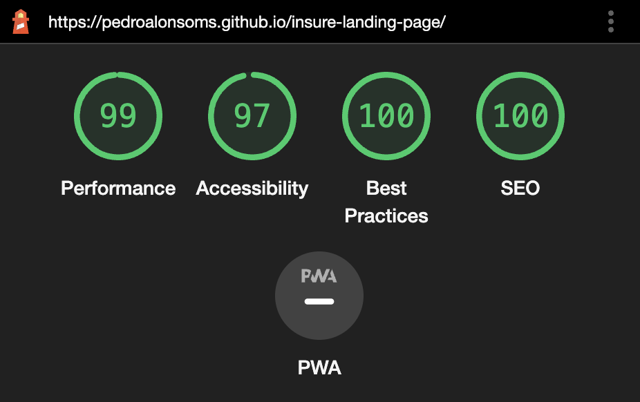

# Frontend Mentor - Insure landing page solution

This is a solution to the [Insure landing page challenge on Frontend Mentor](https://www.frontendmentor.io/challenges/insure-landing-page-uTU68JV8). Frontend Mentor challenges help you improve your coding skills by building realistic projects.

### Links

- [Live](https://pedroalonsoms.github.io/insure-landing-page/) on GitHub Pages

### Showcase

#### Desktop preview

#### Mobile ligthouse stats

### Built with

- [Astro](https://astro.build/) - Static Site Generator
- [Tailwind](https://tailwindcss.com/) - For styles

### Areas that could be improved

- Implement social's svg's active state
- Improve semantics & accesibility
- Organization for the images folder
- Separate HTML into Astro components
- Better coude reusability on the outlined buttons
- Asset compression
- Make it pixel-perfect
- Consistent `mt-pt` and `mb-pt` for spacing
- Deeper Astro's GitHub actions deployment understanding
- Better default font handling
- Use css grid auto-fit for columns
- Better color inheritance/cascade separation
- Improve image attributes
- Better way to import fonts via `link` tag
- Better TypeScript and prop spreading
- Use `em` media queries instead of `px` for consistency across browsers
- Use exact design colors
- Enable on-load event for NavBar
- Fix Layout shifting
- Understand difference between hover and focus
- Better navbar layout design
- More consistent `media` breakpoints
- Add more HTML comments
- Add hover state to mobile nav outlined button
- Handle zoom-in issues
- Make footer grid more responsive
- Make intro-section more resposive in-between transitions

## Acknowledgments

- Kevin Powell's [YouTube Channel](https://www.youtube.com/@KevinPowell) helped me a lot
- Kevin Powell's Responsive Design [Article](https://www.freecodecamp.org/news/taking-the-right-approach-to-responsive-web-design/)
- Theo Brownlee's [YouTube Channel](https://www.youtube.com/@t3dotgg)
- Adam Wathan's [YouTube Channel](https://www.youtube.com/@AdamWathan)
- Workation Repo [Repo](https://github.com/adamwathan/workcation)
- Tons of help from [StackOverflow](https://stackoverflow.com/)
- Help from [Web.dev](https://web.dev/)
- MDN [Mozilla Documentation](https://developer.mozilla.org/)
- [W3Schools](https://www.w3schools.com/)
- [Tailwind CSS best practices](https://gist.github.com/sandren/0f22e116f01611beab2b1195ab731b63)
- [Image alt accessibility](https://www.w3.org/WAI/tutorials/images/decorative/)
- [CSS Tricks](https://css-tricks.com/)
- Spacer WebFlow Class [Article](https://webflow.com/blog/html-spacer)
- Git [conflicts](https://devconnected.com/how-to-undo-last-git-commit/)
- SVG best import method [comparison](https://css-tricks.com/using-svg/)
- SVG [loader](https://css-tricks.com/svg-loader-a-different-way-to-work-with-external-svg/)
- More git [conflicts](https://coderwall.com/p/xyuoza/git-cloning-specific-commits)
- Typescript [issues](https://bobbyhadz.com/blog/typescript-left-hand-side-of-assignment-not-optional)
- Using [markdown](https://www.digitalocean.com/community/tutorials/markdown-markdown-images)
